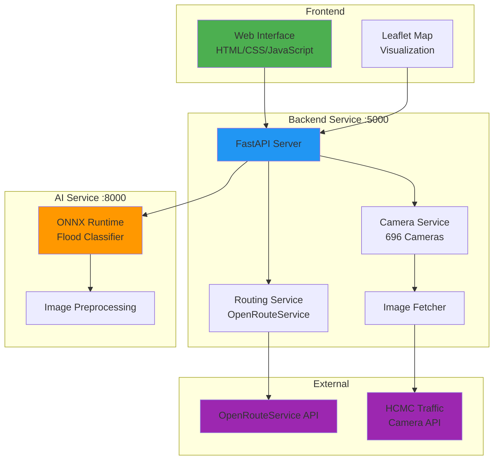

# Flood-AI 🌊

An intelligent flood detection and routing system for Ho Chi Minh City, Vietnam. This system uses AI to analyze real-time traffic camera images, detect flooding, and calculate safe routes that avoid flooded areas.

## 🎯 Overview

Flood-AI is a microservices-based system that combines:

- **AI-powered flood detection** using ONNX Runtime
- **Smart routing** with real-time flood avoidance
- **Real-time traffic camera integration** (696 cameras across HCMC)
- **Interactive web interface** with map visualization

## 🏗️ Architecture



## 🚀 Quick Start

### Prerequisites

- **Python**: >= 3.12
- **uv**: Package manager ([Install uv](https://docs.astral.sh/uv/getting-started/installation/))
- **OpenRouteService API Key**: [Sign up for free](https://openrouteservice.org/dev/#/signup)

### Installation

1. **Clone the repository**:

   ```bash
   git clone https://github.com/kohaku4869/Flood-AI.git
   cd flood-ai
   ```

2. **Install all dependencies using uv**:

   ```bash
   uv sync
   ```

   This installs dependencies for the entire workspace (ai_service + backend_service).

3. **Configure environment variables**:

   ```bash
   # Copy example env file
   cp .env.example .env

   # Edit .env and add your OpenRouteService API key
   # OPENROUTE_API_KEY=your_api_key_here
   ```

### Running the Services

You need to run both services in separate terminals:

**Terminal 1 - AI Service (Port 8000)**:

```bash
uv run ai-service
```

**Terminal 2 - Backend Service (Port 5000)**:

```bash
uv run backend-service
```

**Terminal 3 - Frontend**:
The frontend is served automatically by the backend service at:

```
http://localhost:5000/
```

Open this URL in your browser to access the web interface.

### First Run Notes

- **AI Service**: Starts in ~2 seconds
- **Backend Service**: Starts in ~2 seconds

## 📚 Technology Stack

### AI Service

- **Framework**: FastAPI + Uvicorn
- **Inference**: ONNX Runtime (CPU)
- **Image Processing**: NumPy + Pillow
- **Architecture**: Clean Architecture

### Backend Service

- **Framework**: FastAPI + Uvicorn
- **Routing**: OpenRouteService API
- **Data Processing**: Pandas (696 camera dataset)
- **HTTP Client**: HTTPX (async)
- **Configuration**: python-dotenv

### Frontend

- **Core**: HTML5 + CSS3 + JavaScript
- **Mapping**: Leaflet.js + OpenStreetMap tiles
- **UI/UX**: Modern dark theme with glassmorphism
- **API**: Fetch API for backend communication

## 📁 Project Structure

```
flood-ai/
├── ai_service/              # AI flood detection service (port 8000)
│   ├── src/ai_service/
│   │   ├── __init__.py
│   │   ├── config.py       # Configuration
│   │   ├── core.py         # ONNX model logic
│   │   ├── utils.py        # Image preprocessing
│   │   └── routes.py       # FastAPI routes
│   ├── models/             # ONNX model files
│   ├── pyproject.toml
│   └── README.md           # AI service documentation
│
├── backend_service/         # Backend routing service (port 5000)
│   ├── src/backend_service/
│   │   ├── __init__.py
│   │   ├── config.py       # Environment configuration
│   │   ├── routes.py       # FastAPI routes
│   │   ├── routing_service.py    # OpenRouteService integration
│   │   ├── camera_service.py     # Camera dataset management
│   │   ├── ai_service.py         # AI service client
│   │   └── get_image.py          # Camera image fetcher
│   ├── cache/              # Cached map data (auto-generated)
│   ├── logs/               # Application logs (auto-generated)
│   ├── pyproject.toml
│   ├── README.md           # Backend service documentation
│   └── OPENROUTE_SETUP.md  # OpenRouteService setup guide
│
├── frontend/                # Web interface
│   ├── index.html          # Main HTML
│   ├── styles.css          # Styling (dark theme + glassmorphism)
│   └── app.js              # Frontend logic + Leaflet integration
│
├── dataset/                 # Camera dataset
│   └── dataset_camera_day_du.csv    # 696 HCMC traffic cameras
│
├── pyproject.toml          # Root workspace configuration
├── uv.lock                 # Dependency lock file
└── README.md               # This file
```

## 🔌 API Documentation

### AI Service (Port 8000)

**Health Check**: `GET /health`

```json
{
  "status": "healthy",
  "service": "flood-classification-ai",
  "version": "v1",
  "model": {
    "loaded": true,
    "info": {...}
  }
}
```

**Predict**: `POST /api/v1/predict`

- **Input**: Image file (multipart/form-data)
- **Output**: Flood classification with confidence

```json
{
  "success": true,
  "prediction": {
    "class": "flood",
    "confidence": 0.9854,
    "confident": true,
    "probabilities": {
      "dry_road": 0.0146,
      "flood": 0.9854
    }
  }
}
```

### Backend Service (Port 5000)

**Health Check**: `GET /health`

```json
{
  "status": "healthy"
}
```

**Route Request**: `POST /route_request`

```json
{
  "start_coords": { "lat": 10.762622, "lng": 106.660172 },
  "end_coords": { "lat": 10.773163, "lng": 106.654367 },
  "camera_ids": ["59d3524f02eb490011a0a61b", "5a6065c58576340017d06615"]
}
```

**Response**:

```json
{
  "status": "success",
  "message": "Route calculated",
  "data": {
    "start": {"lat": 10.762622, "lng": 106.660172},
    "end": {"lat": 10.773163, "lng": 106.654367},
    "camera_count": 2,
    "flooded_count": 2,
    "flooded_coords": [...],
    "path": [...],
    "path_length": 24
  }
}
```

## 🎨 Features

### ✨ Frontend Features

- **Interactive Map**: OpenStreetMap with dark theme tiles
- **Location Search**: Autocomplete search for start/end points using Nominatim
- **Camera Selection**: Browse and select from 696 traffic cameras
- **Real-time Status**: Live updates on flood detection and routing
- **Route Visualization**: Color-coded routes (green = safe, avoid flooded areas)
- **Flood Markers**: Visual indicators for detected flood locations

### 🧠 AI Features

- **ONNX Runtime**: Fast CPU inference without GPU requirements
- **High Accuracy**: Trained flood detection model
- **Confidence Threshold**: 0.7 (configurable)
- **Two Classes**: `dry_road` and `flood`

### 🗺️ Routing Features

- **Smart Avoidance**: Routes avoid flooded areas with 150m radius
- **Map Caching**: 10-20x faster startup after first run
- **Graceful Degradation**: Falls back to normal routing if no safe route exists
- **Real-time Updates**: Integrates with live camera feeds

## 🧪 Testing

### AI Service Tests

```bash
cd ai_service
uv run python test_service.py
```

### Backend Service Tests

```bash
cd backend_service
uv run pytest tests/unit
```

### Integration Tests

Requires both services running:

```bash
cd backend_service
uv run python tests/integration/verify_integration.py
```

## 📊 Performance

| Metric             | Value            |
| ------------------ | ---------------- |
| AI Inference       | ~500ms per image |
| Route Calculation  | ~1-2s            |
| Camera Image Fetch | ~2s (concurrent) |
| Total Request      | ~4s end-to-end   |
| Map Cache Load     | 15s (from cache) |
| First Map Download | 2-5 minutes      |
| Camera Dataset     | 696 cameras      |
| Map Nodes          | 146,179 nodes    |

## 🔧 Configuration

### Environment Variables

See [`backend_service/.env.example`](backend_service/.env.example) for all configuration options:

- **AI_SERVICE_URL**: AI service endpoint (default: http://localhost:8000/api/v1/predict)
- **OPENROUTE_API_KEY**: Your OpenRouteService API key (required)
- **FLOOD_BLOCK_RADIUS_METERS**: Flood avoidance radius (default: 150m)
- **CAMERA_DATASET_PATH**: Path to camera CSV file
- **LOG_LEVEL**: Logging level (INFO, DEBUG, WARNING, ERROR)

## 🐛 Troubleshooting

### Services won't start

```bash
# Check Python version
python --version  # Should be >= 3.12

# Reinstall dependencies
uv sync --force
```

### AI Service connection refused

```bash
# Ensure AI service is running on port 8000
curl http://localhost:8000/health
```

### Routes don't avoid floods

1. Check OpenRouteService API key in `.env`
2. Verify backend service restarted after config change
3. Check logs at `backend_service/logs/backend_service.log`

### Map download fails

- Check internet connection
- OSM might be temporarily unavailable
- Try again in a few minutes

## 📖 Documentation

- **[AI Service README](ai_service/README.md)**: Detailed AI service documentation
- **[Backend Service README](backend_service/README.md)**: Complete backend API documentation
- **[OpenRouteService Setup](backend_service/OPENROUTE_SETUP.md)**: API key setup guide

## 🤝 Contributing

Contributions are welcome! Please:

1. Fork the repository
2. Create a feature branch (`git checkout -b feature/amazing-feature`)
3. Commit your changes (`git commit -m 'Add amazing feature'`)
4. Push to the branch (`git push origin feature/amazing-feature`)
5. Open a Pull Request

## 📄 License

MIT License - see LICENSE file for details

## 🙏 Acknowledgments

- **Ho Chi Minh City Traffic Camera System**: For camera data and image feeds
- **OpenRouteService**: For routing API with flood avoidance support
- **OpenStreetMap**: For map data
- **Leaflet.js**: For interactive map visualization

## 📧 Contact

- **Author**: tuanq
- **Email**: tuanquangkhk@gmail.com
- **Repository**: [github.com/kohaku4869/Flood-AI](https://github.com/kohaku4869/Flood-AI)

---

**Built with ❤️ for safer navigation during floods in Ho Chi Minh City**
